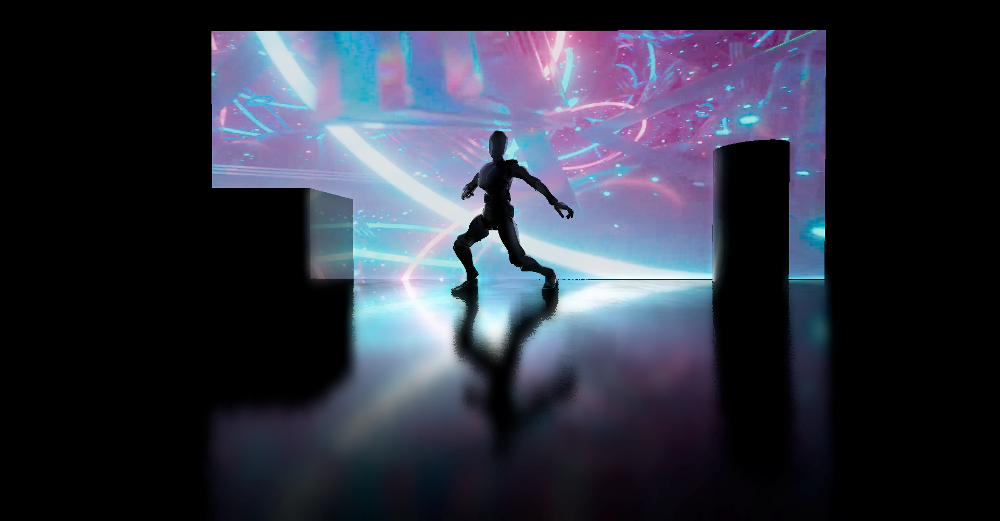
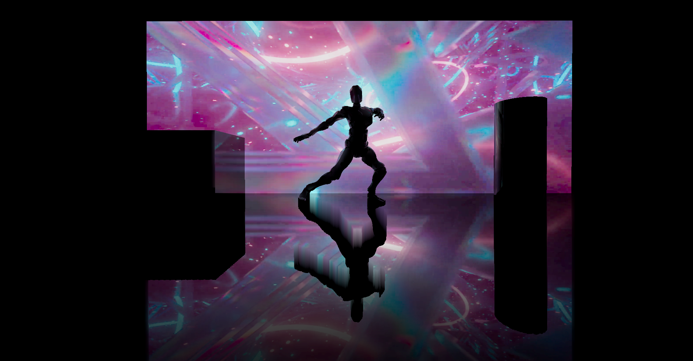
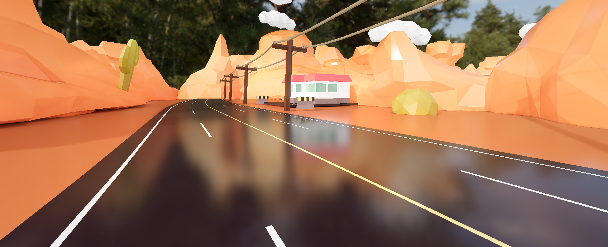
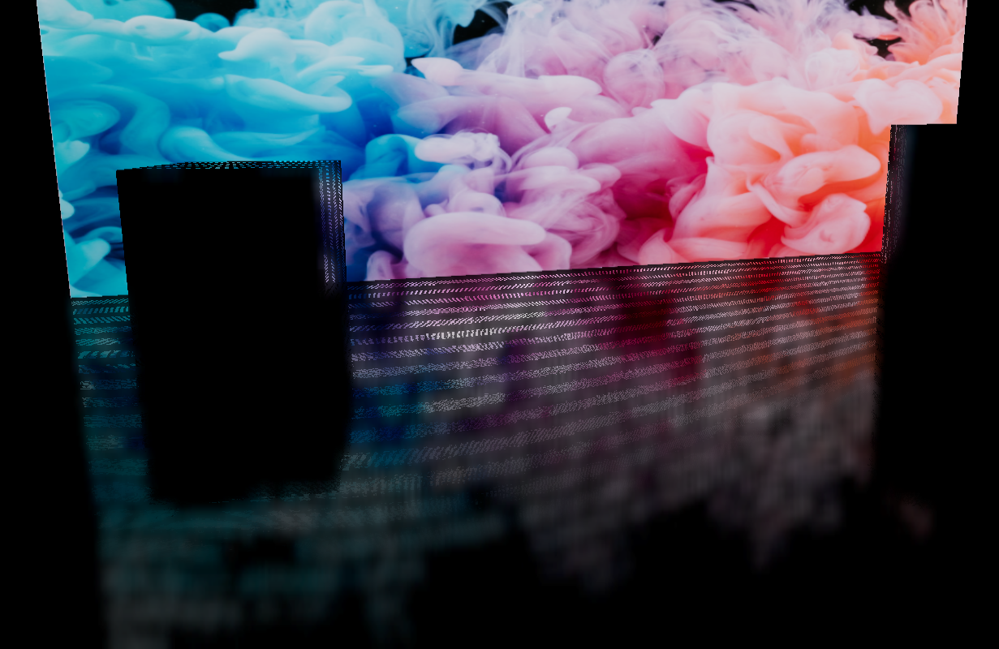

# three.js Screen Space Reflections

Implements performant Screen Space Reflections in three.js.
<br></br>
[](https://screen-space-reflections.vercel.app/?dancer=true)
Glossy Reflections
<br></br>
[](https://screen-space-reflections.vercel.app/?dancer=true)
Clean Reflections
<br></br>
[](https://screen-space-reflections.vercel.app/?desert=true)

<br>

## Demos

- [Dancer with Animated Background](https://screen-space-reflections.vercel.app/?dancer=true)

- [Basic](https://screen-space-reflections.vercel.app/)

- [Desert](https://screen-space-reflections.vercel.app/?desert=true)

react-three-fiber demos:

- [Rover](https://codesandbox.io/s/ssr-rover-leixne?file=/src/Sophia-v1.js)

- [three.js journey scene](https://codesandbox.io/s/ssr-threejs-journey-84he6c)

## Run Locally

If you'd like to test this project and run it locally, run these commands:

```
git clone https://github.com/0beqz/screen-space-reflections
cd screen-space-reflections
npm i
npm run dev
```

## Usage

If you are using [react-three-fiber](https://github.com/pmndrs/react-three-fiber), you can also use the `SSR` component from [react-postprocessing](https://github.com/pmndrs/react-postprocessing). Check out the react-three-fiber demos to see how it's used there.
<br>

### Basic usage:

Install the package first:

```
npm i screen-space-reflections
```

Then add it to your code like so:

```javascript
import { SSRPass } from "screen-space-reflections"

const composer = new POSTPROCESSING.EffectComposer(renderer)

const ssrPass = new SSRPass(scene, camera, options?)
composer.addPass(ssrPass)
```

### Options

Default values of the optional `options` parameter:

```javascript
const options = {
	width: window.innerWidth,
	height: window.innerHeight,
	useBlur: true,
	blurKernelSize: POSTPROCESSING.KernelSize.SMALL,
	blurWidth: window.innerWidth,
	blurHeight: window.innerHeight,
	rayStep: 0.1,
	intensity: 1,
	power: 1,
	depthBlur: 0.1,
	enableJittering: false,
	jitter: 0.1,
	jitterSpread: 0.1,
	jitterRough: 0.1,
	roughnessFadeOut: 1,
	MAX_STEPS: 20,
	NUM_BINARY_SEARCH_STEPS: 5,
	maxDepthDifference: 3,
	maxDepth: 1,
	thickness: 10,
	ior: 1.45,
	stretchMissedRays: false,
	useMRT: true,
	useNormalMap: true,
	useRoughnessMap: true
}
```

Description:

- `width`: width of the SSRPass

- `height`: height of the SSRPass

- `useBlur`: whether to blur the reflections and blend these blurred reflections depending on the roughness and depth of the reflection ray

- `blurKernelSize`: the kernel size of the blur pass which is used to blur reflections; higher kernel sizes will result in blurrier reflections with more artifacts

- `blurWidth`: the width of the blur pass

- `blurHeight`: the height of the blur pass

- `rayStep`: how much the reflection ray should travel in each of its iteration; higher values will give deeper reflections but with more artifacts

- `intensity`: the intensity of the reflections

- `power`: the power by which the reflections should be potentiated; higher values will give a more intense and vibrant look

- `depthBlur`: how much deep reflections will be blurred (as reflections become blurrier the further away the object they are reflecting is)

- `enableJittering`: whether jittering is enabled; jittering will randomly jitter the reflections resulting in a more noisy but overall more realistic look, enabling jittering can be expensive depending on the view angle

- `jitter`: how intense jittering should be

- `jitterSpread`: how much the jittered rays should be spread; higher values will give a rougher look regarding the reflections but are more expensive to compute with

- `jitterRough`: how intense jittering should be in relation to a material's roughness

- `MAX_STEPS`: the number of steps a reflection ray can maximally do to find an object it intersected (and thus reflects)

- `NUM_BINARY_SEARCH_STEPS`: once we had our ray intersect something, we need to find the exact point in space it intersected and thus it reflects; this can be done through binary search with the given number of maximum steps

- `maxDepthDifference`: the maximum depth difference between a ray and the particular depth at its screen position after refining with binary search; lower values will result in better performance

- `maxDepth`: the maximum depth for which reflections will be calculated

- `thickness`: the maximum depth difference between a ray and the particular depth at its screen position before refining with binary search; lower values will result in better performance

- `ior`: Index of Refraction, used for calculating fresnel; reflections tend to be more intense the steeper the angle between them and the viewer is, the ior parameter set how much the intensity varies

- `stretchMissedRays`: if there should still be reflections for rays for which a reflecting point couldn't be found; enabling this will result in stretched looking reflections which can look good or bad depending on the angle

- `useMRT`: WebGL2 only - whether to use multiple render targets when rendering the G-buffers (normals, depth and roughness); using them can improve performance as they will render all information to multiple buffers for each fragment in one run

- `useRoughnessMaps`: if roughness maps should be taken account of when calculating reflections

- `useNormalMaps`: if normal maps should be taken account of when calculating reflections

## Features

- Jittering and blurring reflections to approximate glossy reflections
- Using three.js' WebGLMultipleRenderTarget (WebGL2 only) to improve performance when rendering scene normals, depth and roughness
- Early out cases to compute only possible reflections and boost performance
- Blurring reflections using Kawase Blur Pass for better performance over a Gaussian Blur Pass

## Tips

### Getting the right look

SSR usually needs a lot of tweaking before it looks alright in a scene, so using a GUI where you can easily modify all values is highly recommended.
The demo uses [tweakpane](https://cocopon.github.io/tweakpane/) as the GUI. If you want to use it, check out how it's initalized and used in the demo: https://github.com/0beqz/screen-space-reflections/blob/main/src/index.js.
<br>

### Handling noise

To smooth out noise from jittering, set the `blurKernelSize` to 2 or 3 and increase `depthBlur` precisely while using rather low values for `blurWidth` and `blurHeight`. This will blur out reflections the "deeper" they are.
<br>

### Getting rid of artifacts

If you are getting artifacts, for example:
<br>


Then try the following:

- increase `thickness`
- increase `maxDepthDifference`
- increase `maxDepth` or set it directly to 1
- decrease `rayStep` and increase `MAX_STEPS` if reflections are cutting off now
- increase `NUM_BINARY_SEARCH_STEPS`

Keep in mind that increasing these values will have an impact on performance.
<br>

### Hiding missing reflections

Since SSR only works with screen-space information, there'll be artifacts when there's no scene information for a reflection ray.
This usually happens when another objects occludes a reflecting object behind it.
<br>
To make missing reflections less apparent, use an env-map that can then be used as a fallback when there is no reflection.
Ideally use a box-projected env-map.

Here are two implementations for three.js and react-three-fiber:

- [Gist to include box-projected env-maps in three.js](https://gist.github.com/0beqz/8d51b4ae16d68021a09fb504af708fca)
- [useBoxProjectedEnv in react-three-fiber](https://github.com/pmndrs/drei#useboxprojectedenv)
  <br>

## Todos

- [ ] Add Temporal Filtering to reduce noise

## Credits

- SSR code: [Screen Space Reflections on Epsilon Engine](https://imanolfotia.com/blog/1)

- Edge fade for SSR: [kode80](http://kode80.com/blog/)

- Colorful smoke picture: [Pawel Czerwinski](https://unsplash.com/@pawel_czerwinski)

- Video texture: [Uzunov Rostislav](https://www.pexels.com/@rostislav/)

## Resources

- [Rendering view dependent reflections using the graphics card](https://kola.opus.hbz-nrw.de/opus45-kola/frontdoor/deliver/index/docId/908/file/BA_GuidoSchmidt.pdf)

- [Screen Space Reflections in Unity 5](http://www.kode80.com/blog/2015/03/11/screen-space-reflections-in-unity-5/)

- [Screen Space Glossy Reflections](http://roar11.com/2015/07/screen-space-glossy-reflections/)

- [Screen Space Reflection (SSR)](https://lettier.github.io/3d-game-shaders-for-beginners/screen-space-reflection.html)

- [Approximating ray traced reflections using screenspace data](https://publications.lib.chalmers.se/records/fulltext/193772/193772.pdf)

- [Screen Space Reflection Techniques](https://ourspace.uregina.ca/bitstream/handle/10294/9245/Beug_Anthony_MSC_CS_Spring2020.pdf)

- [Shiny Pixels and Beyond: Real-Time Raytracing at SEED](https://media.contentapi.ea.com/content/dam/ea/seed/presentations/dd18-seed-raytracing-in-hybrid-real-time-rendering.pdf)
